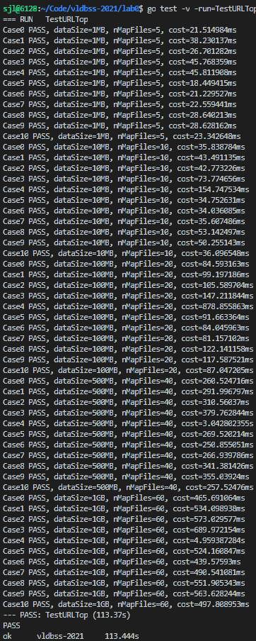

# Lab0 实验报告

## 实验结果

### 1. 完成 Map-Reduce 框架

`make test_example` 的实验截图

### 2. 基于 Map-Reduce 框架编写 Map-Reduce 函数

`make test_homework` 的实验截图

## 实验总结

在这部分可以简单谈论自己在实验过程中遇到的困难、对 Map-Reduce 计算框架的理解，字数在 1000 字以内。

### 1. MapReduce

MapReduce是一个分布式的计算框架，在2004年google发表的MapReduce: Simplified Data Processing on Large Clusters论文中被提出，
主要是为了充分利用多台机器来并行处理大量的计算。 当然，这样的框架也方便了许多不了解分布式的程序员的开发工作，带来了极大的便利。

MapReduce的主要思想是分而治之。也就是将需要处理的问题抽象成Map函数和Reduce函数两个部分，通过对任务的拆分和合并来处理大量的数据。
Map函数负责数据的预处理，得到一系列的KV Pair。紧接着，Reduce函数对这些数据进行合并，得到最终结果。

URLTop的框架示意图如下：

### 2. 实验过程

这个实验相对于Mit6.824来说比较简单。

#### （1） 完成 Map-Reduce 框架

根据介绍文档中的提示在 mapreduce.go 的 YOUR CODE HERE 标记处补充代码。 由于Map的代码已经给出，Reduce可以仿照处理。

遇到的一个问题是，写完这两处进行测试的时候发现跑不起来。后来查看测试文件，发现需要将Reduce输出的多个文件名放在一个最终的文件中进行比较测试。

#### （2） 基于 Map-Reduce 框架编写 Map-Reduce 函数

URLTop10可以根据ExampleURLTop10来完成。

一般处理Topx的MapReduce思路是：第一轮MapReduce输出结果为分布在不同文件中的多个<URL, count>对。第二轮MapReduce进行排序并获取top10。

